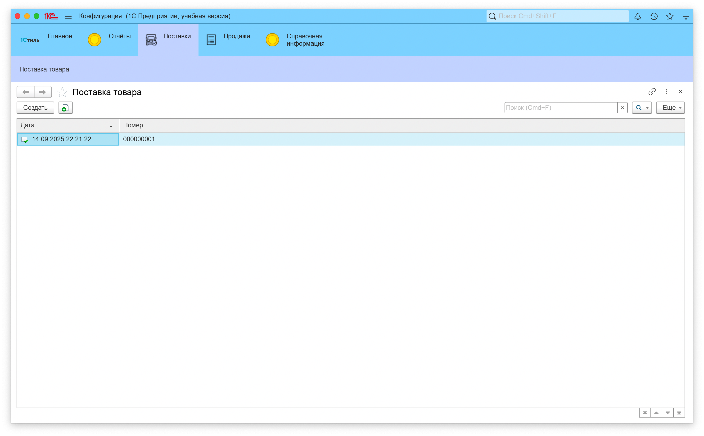

# Инструкция пользователя информационной системы магазина одежды "1Стиль"

## О системе

**Информационная система на базе 1С для магазина одежды "1Стиль"** - это центральная цифровая система нашего бизнеса, построенная на платформе «1С:Предприятие 8».

### Назначение системы

Мы используем 1С не просто как бухгалтерскую программу, а как комплексное решение для:

- **Прозрачности бизнеса** - все сотрудники получают доступ к актуальной информации
- **Автоматизации рутинных операций** - сбор данных, согласование документов, оповещения
- **Упрощения отчетности** - быстрое создание аналитических отчетов
- **Развития клиентской базы** - интеграция с сайтом для привлечения новых покупателей
- **Системы лояльности** - автоматическое предоставление скидок на основе суммы выкупа клиентов

---

## Содержание

1. [Начало работы](#начало-работы)
2. [Справочная информация](#справочная-информация)
3. [Система лояльности](#система-лояльности)
4. [Модуль "Продажи"](#модуль-продажи)
5. [Модуль "Поставки"](#модуль-поставки)
6. [Отчеты](#отчеты)

---

## Начало работы

### Запуск системы

1. Запустите программу "1С:Предприятие 8"
2. Выберите информационную базу "1Стиль"
3. Введите ваши учетные данные
4. Нажмите "ОК" для входа в систему

### Основные элементы интерфейса

После входа в систему вы увидите:

- **Главное меню** - навигация по разделам системы
- **Панель функций** - быстрый доступ к часто используемым операциям
- **Рабочую область** - основное пространство для работы с документами и справочниками

### Роли пользователей

В системе предусмотрены следующие роли:

- **ПолныеПрава** - полный доступ ко всем функциям (администраторы, руководители)
- **Продажа** - работа с продажами, клиентами, отчетами по продажам
- **Поставки** - работа с поставщиками, поступлением товаров, контроль закупок

---

## Справочная информация

Справочная информация - это основа всей системы. Здесь хранятся все базовые данные.

### Справочник "Контрагенты"

**Назначение:** Ведение информации о покупателях и поставщиках.

#### Создание нового контрагента

1. Откройте раздел "Справочная информация"
2. Выберите "Контрагенты"
3. Нажмите "Создать"
4. Заполните обязательные поля:
   - **Наименование** - название организации или ФИО физического лица
   - **Тип контрагента** - выберите из перечисления (покупатель, поставщик)

#### Дополнительные реквизиты

- **ФИО** - для физических лиц
- **Дата рождения** - для персонализированных предложений
- **Телефон** - контактный номер (до 17 символов)
- **Email** - для электронной рассылки (до 50 символов)
- **Уровень клиента** - классификация клиента по статусу (Базовый, Премиальный, ВИП клиент)

#### Практические советы

- Всегда указывайте тип контрагента для корректной работы отчетов
- Регулярно обновляйте контактную информацию
- Используйте поле "Комментарий" для важных заметок о клиенте

### Справочник "Организации"

**Назначение:** Учет юридических лиц.

#### Настройка организации

1. Заполните полное наименование организации
2. Укажите юридические реквизиты (ИНН, КПП, ОГРН)
3. Добавьте банковские реквизиты
4. Настройте параметры учета

### Справочник "Номенклатура"

**Назначение:** Каталог всех товаров магазина одежды.

#### Создание товара

1. Откройте "Номенклатура"
2. Нажмите "Создать"
3. Заполните основные данные:
   - **Наименование** - название товара
   - **Артикул** - уникальный код товара
   - **Вид номенклатуры** - выберите "Товар"

#### Характеристики товаров одежды

Используйте перечисления для классификации:

- **Виды номенклатуры** - товар, услуга
- **Размеры** - S, M, L, XL, XXL и т.д.
- **Материалы** - хлопок, полиэстер, шерсть и т.д.
- **Единицы измерения** - штука, комплект

#### Группировка товаров

Создавайте группы для удобной навигации:

- Мужская одежда
  - Рубашки
  - Брюки
  - Костюмы
- Женская одежда
  - Блузки
  - Юбки
  - Платья
- Детская одежда
- Аксессуары

### Регистр сведений "Цены номенклатуры"

**Назначение:** Ведение актуальных цен на товары.

#### Установка цен

1. Откройте регистр "Цены номенклатуры"
2. Нажмите "Создать"
3. Укажите:
   - **Период** - дата начала действия цены
   - **Номенклатура** - выберите товар
   - **Цена** - стоимость товара

#### Работа с типами цен

- **Розничная цена** - для продажи покупателям
- **Оптовая цена** - для крупных заказов
- **Закупочная цена** - для расчета маржинальности

### Перечисления системы

Перечисления обеспечивают единообразие классификации данных:

- **Виды номенклатуры**: Товар, Услуга
- **Единицы измерения**: Штука, Комплект, Пара
- **Размеры**: XS, S, M, L, XL, XXL, XXXL
- **Материалы**: Хлопок, Полиэстер, Шерсть, Лен, Шелк
- **Типы контрагентов**: Покупатель, Поставщик, Покупатель и поставщик
- **Тип клиента**: Базовый, Премиальный, ВИП клиент

---

## Система лояльности

Система лояльности магазина "1Стиль" автоматически предоставляет скидки клиентам на основе суммы их покупок. Это помогает удерживать постоянных клиентов и стимулирует повторные покупки.

### Принцип работы системы лояльности

Система автоматически отслеживает общую сумму покупок каждого клиента и присваивает ему соответствующий уровень с автоматическим предоставлением скидки.

### Уровни клиентов и размеры скидок

#### Базовый клиент

- **Условие**: сумма выкупа менее 15 000 рублей
- **Размер скидки**: 0% (без скидки)
- **Описание**: новые клиенты или клиенты с небольшими покупками

#### Премиальный клиент

- **Условие**: сумма выкупа от 15 000 до 30 000 рублей
- **Размер скидки**: 5%
- **Описание**: постоянные клиенты с регулярными покупками

#### ВИП клиент

- **Условие**: сумма выкупа более 30 000 рублей
- **Размер скидки**: 10%
- **Описание**: самые ценные клиенты с высокими объемами покупок

### Автоматическое применение скидок

При оформлении документа "Реализация товара":

1. **Система автоматически определяет** уровень клиента на основе суммы выкупа
2. **Применяет соответствующую скидку** к сумме покупки
3. **Рассчитывает итоговую сумму** с учетом скидки
4. **Обновляет общую сумму выкупа** клиента в регистре

### Установка уровня клиента

Уровень клиента устанавливается **вручную** в справочнике "Контрагенты" на основании данных отчета "Сумма выкупа":

1. Откройте отчет "Сумма выкупа"
2. Определите текущую сумму выкупа клиента
3. Откройте справочник "Контрагенты"
4. Найдите нужного клиента
5. Установите соответствующий "Уровень клиента"
6. Сохраните изменения

### Практические рекомендации

**Для менеджеров по продажам:**

- Информируйте клиентов о приближении к следующему уровню лояльности
- Используйте информацию об уровне клиента для персонализированного обслуживания

---

## Модуль "Продажи"

Модуль продаж - ключевой инструмент для оформления покупок и контроля доходов.

### Документ "Реализация товара"

**Назначение:** Оформление продажи товаров покупателям.

#### Создание документа продажи

1. **Открытие формы**
   - Перейдите в раздел "Продажи"
   - Нажмите "Создать" → "Реализация товара"

2. **Заполнение шапки документа**
   - **Дата** - дата продажи (по умолчанию текущая)
   - **Клиент** - выберите из справочника контрагентов
   - **Организация** - ваша организация (автоматически)

3. **Заполнение табличной части "Товары"**

   Для каждой позиции указывайте:
   - **Товар** - выберите из справочника номенклатуры
   - **Количество** - количество продаваемого товара
   - **Сумма** - рассчитывается автоматически на основе цены

#### Автоматизация расчетов

Система автоматически:

- Подставляет актуальную цену из регистра "Цены номенклатуры"
- Рассчитывает сумму по строке (количество × цена)
- **Определяет уровень клиента** и применяет соответствующую скидку
- **Рассчитывает сумму скидки** на основе уровня клиента
- Подводит общую сумму документа с учетом скидки
- Проверяет наличие товара на остатках

#### Проведение документа

1. Проверьте корректность всех данных
2. Нажмите "Провести"
3. Система автоматически:
   - Спишет товары с остатков
   - Отразит выручку
   - Создаст движения в регистре "Остатки номенклатуры"

#### Контроль остатков

⚠️ **Внимание:** Система не позволит продать больше товара, чем есть на остатках.

При недостатке товара:

1. Проверьте текущие остатки в отчете
2. Оформите поступление от поставщика
3. Только после этого проводите продажу

### Работа с ценами и скидками при продаже

#### Автоматическое определение цен

- Система использует актуальные цены на дату документа
- Цены берутся из регистра "Цены номенклатуры"
- При отсутствии цены система выдаст предупреждение

#### Система лояльности в документе

При выборе клиента система автоматически:

1. **Проверяет уровень клиента** в справочнике "Контрагенты"
2. **Применяет соответствующую скидку**:
   - Базовый клиент: скидка 0%
   - Премиальный клиент: скидка 5%
   - ВИП клиент: скидка 10%
3. **Отображает информацию о скидке** в документе
4. **Рассчитывает итоговую сумму** с учетом скидки

#### Корректировка цен и скидок

- Менеджеры могут изменять цены в документе
- **Скидки применяются автоматически** на основе уровня клиента
- Изменения не влияют на справочные цены
- Все изменения сохраняются в истории документа

### Анализ продаж

#### Ключевые показатели

- Объем продаж за период
- Популярные товары
- Эффективность менеджеров
- Средний чек покупателя

---

## Модуль "Поставки"

Модуль поставок обеспечивает учет поступления товаров от поставщиков.

### Документ "Поставка товара"

**Назначение:** Регистрация поступления товаров на склад.

#### Оформление поступления

1. **Создание документа**
   - Откройте раздел "Поставки"
   - Выберите "Создать" → "Поставка товара"

2. **Основные реквизиты**
   - **Дата** - дата поступления товара
   - **Поставщик** - выберите из справочника контрагентов
   - **Документ поставщика** - номер накладной поставщика

3. **Товары к поступлению**

   В табличной части укажите:
   - **Товар** - номенклатура из справочника
   - **Количество** - фактически поступившее количество
   - **Цена** - закупочная цена
   - **Сумма** - автоматически рассчитывается

#### Влияние на остатки

После проведения документа:

- Товары поступят на склад
- Увеличатся остатки в регистре "Остатки номенклатуры"
- Сформируется задолженность перед поставщиком

### Планирование закупок

#### Анализ потребности

1. Регулярно проверяйте отчет по остаткам
2. Выявляйте товары с низкими остатками
3. Анализируйте динамику продаж
4. Планируйте закупки с учетом сезонности

#### Работа с поставщиками

- Ведите историю поставок
- Контролируйте сроки поставки
- Отслеживайте качество товаров
- Анализируйте условия сотрудничества

---

## Отчеты

Система отчетности - инструмент для анализа и принятия управленческих решений.

### Отчет "Остатки номенклатуры"

**Назначение:** Контроль текущих остатков товаров на складе.

#### Формирование отчета

1. **Открытие отчета**
   - Перейдите в раздел "Отчеты"
   - Выберите "Остатки номенклатуры"

2. **Настройка параметров**
   - **Период** - выберите дату, на которую нужны остатки
   - **Номенклатура** - можете выбрать конкретные товары или группы
   - **Организация** - укажите организацию (если их несколько)

3. **Дополнительные настройки**
   - Группировка по видам номенклатуры
   - Отбор по размерам или материалам
   - Сортировка по наименованию или количеству

#### Анализ результатов

Отчет показывает:

- **Текущие остатки** каждого товара
- **Группировку** по категориям товаров
- **Товары с нулевыми остатками** (требующие заказа)
- **Стоимость** остатков в денежном выражении

#### Практическое применение

**Для менеджеров по закупкам:**

- Выявление товаров для заказа
- Планирование объемов закупок
- Контроль неликвидных остатков

**Для продавцов:**

- Проверка наличия товара перед продажей
- Информирование клиентов о доступности
- Предложение аналогов при отсутствии товара

**Для руководителей:**

- Анализ эффективности товарных запасов
- Контроль замораживания средств в остатках
- Планирование ассортиментной политики

### Работа с регистрами накопления

#### Регистр "Остатки номенклатуры"

Регистр автоматически ведет учет движения товаров:

- **Приход** - от документов "Поставка товара"
- **Расход** - от документов "Реализация товара"
- **Остаток** - разность между приходом и расходом

#### Регистр "Сумма выкупа клиента"

Новый регистр для анализа клиентской базы:

- **Назначение** - накопление общей суммы покупок каждого клиента
- **Измерения** - Покупатель (ссылка на справочник контрагентов)
- **Ресурсы** - Сумма выкупа (числовое значение)
- **Автоматическое заполнение** - при проведении документов "Реализация товара"

#### Контроль движений

- Все движения привязаны к документам
- Нельзя изменить остатки напрямую
- Исправления только через документы

### Отчет "Сумма выкупа"

**Назначение:** Анализ клиентской базы по объемам покупок и управление системой лояльности.

#### Формирование отчета "Сумма выкупа"

1. **Открытие отчета**
   - Перейдите в раздел "Отчеты"
   - Выберите "Сумма выкупа"

2. **Настройка параметров**
   - **Период** - выберите период для анализа
   - **Покупатель** - можете выбрать конкретных клиентов или группы
   - **Организация** - укажите организацию (если их несколько)

#### Анализ результатов отчета "Сумма выкупа"

Отчет показывает:

- **Общую сумму покупок** каждого клиента за период
- **Количество покупок** по каждому клиенту
- **Средний чек** клиента
- **Текущий уровень клиента** в системе лояльности
- **Близость к следующему уровню** (сколько нужно потратить для повышения статуса)
- **Рекомендуемый уровень** на основе суммы выкупа

#### Практическое применение отчета "Сумма выкупа"

**Для менеджеров по продажам:**

- Выявление VIP-клиентов для персонального обслуживания
- Планирование индивидуальных предложений
- Анализ эффективности работы с клиентами
- **Информирование клиентов о приближении к следующему уровню лояльности**
- **Контроль корректности применения скидок**

**Для маркетологов:**

- Сегментация клиентской базы по уровням лояльности
- Планирование рекламных кампаний для разных сегментов
- Анализ лояльности клиентов и эффективности системы скидок
- **Разработка программ для стимулирования повышения уровня**

**Для руководителей:**

- Оценка качества клиентской базы
- Планирование стратегии развития системы лояльности
- Контроль эффективности продаж и применения скидок
- **Анализ влияния системы лояльности на выручку**

### Дополнительные отчеты

Система также предоставляет возможность создания отчетов по:

- Продажам за период
- Популярности товаров
- Эффективности сотрудников
- Анализу покупателей

---

### Работа с системой лояльности

#### Ежедневные задачи менеджера

**При оформлении продажи:**

1. **Проверьте уровень клиента** - система покажет текущий статус
2. **Убедитесь в корректности скидки** - проверьте автоматический расчет
3. **Информируйте клиента о скидке** - объясните преимущества его уровня
4. **Сообщите о приближении к следующему уровню** - если клиент близок к повышению

**Еженедельные задачи:**

1. **Проверьте отчет "Сумма выкупа"** на предмет клиентов, готовых к повышению уровня
2. **Обновите уровни клиентов** в справочнике "Контрагенты"
3. **Проанализируйте эффективность скидок** - сколько клиентов повысили уровень

#### Работа с клиентами разных уровней

**Базовые клиенты (0% скидки):**

- Расскажите о системе лояльности
- Объясните преимущества повышения уровня
- Мотивируйте на повторные покупки

**Премиальные клиенты (5% скидки):**

- Подчеркните их статус постоянного клиента
- Предложите товары с учетом их предпочтений
- Информируйте о приближении к ВИП-статусу

**ВИП клиенты (10% скидки):**

- Обеспечьте персональное обслуживание
- Предлагайте эксклюзивные товары
- Поддерживайте высокий уровень сервиса

### Интеграция с бизнес-процессами

#### Автоматизация рутинных операций

- Используйте шаблоны для типовых документов
- Настройте автоматические оповещения
- Применяйте массовые операции для экономии времени
- **Автоматическое применение скидок** на основе уровня клиента

#### Работа в команде

- Соблюдайте единые стандарты оформления
- Используйте комментарии для важной информации
- Координируйте действия через систему задач
- **Согласованно обновляйте уровни клиентов** на основе отчетов

### Взаимосвязь модулей и объектов

Понимание связей между объектами поможет эффективнее работать:

#### Цепочка "Поставка → Остатки → Продажа → Лояльность"

1. **Поставка товара** увеличивает остатки
2. **Остатки** контролируют возможность продажи
3. **Реализация товара** уменьшает остатки и **обновляет сумму выкупа клиента**
4. **Сумма выкупа** определяет уровень лояльности и размер скидки

#### Использование справочников

- **Контрагенты** используются в документах поставки и реализации, содержат уровень лояльности
- **Номенклатура** является основой для всех товарных операций
- **Цены** автоматически подставляются в документы продаж
- **Уровень клиента** автоматически применяет скидки в документах продаж

#### Роли и права доступа

- **Продажа** - доступ к клиентам и документам реализации
- **Поставки** - работа с поставщиками и поступлениями
- **ПолныеПрава** - управление всеми аспектами системы

---

## Заключение

Информационная система магазина одежды "1Стиль" - это мощный инструмент для эффективного управления торговым предприятием. Правильное использование всех модулей системы позволит:

- **Повысить прозрачность бизнеса** для всех сотрудников
- **Автоматизировать рутинные операции** и сосредоточиться на развитии
- **Принимать обоснованные решения** на основе актуальных данных
- **Улучшить качество обслуживания** клиентов
- **Реализовать эффективную систему лояльности** с автоматическими скидками
- **Повысить лояльность клиентов** и стимулировать повторные покупки

### Ключевые преимущества системы лояльности

- **Автоматическое применение скидок** на основе суммы выкупа
- **Простая система уровней**: Базовый, Премиальный, ВИП
- **Прозрачные условия**: четкие пороги для каждого уровня
- **Интеграция с продажами**: скидки применяются автоматически в документах

Помните: система работает эффективно только при качественном ведении данных всеми сотрудниками. Следуйте инструкциям, своевременно вносите информацию, регулярно обновляйте уровни клиентов и не забывайте о взаимосвязи всех операций в системе.
